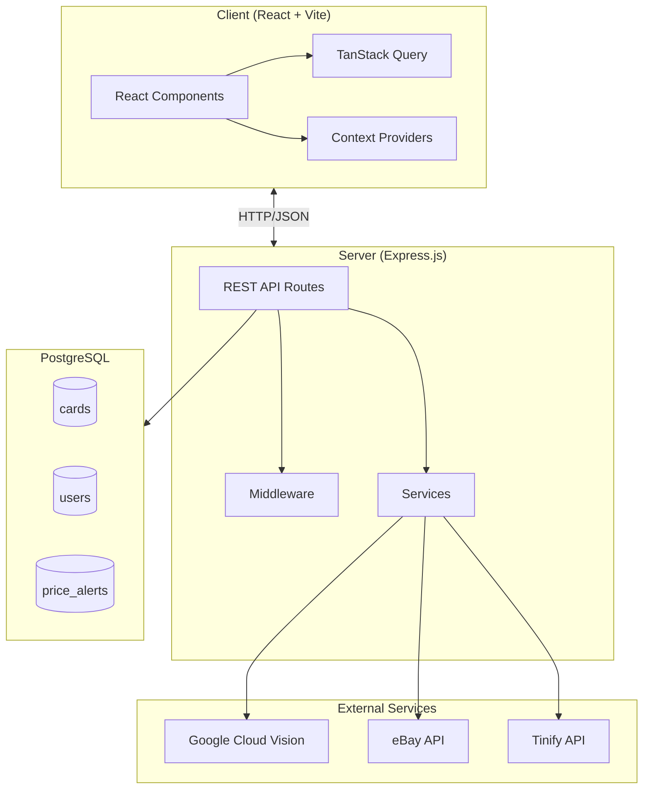
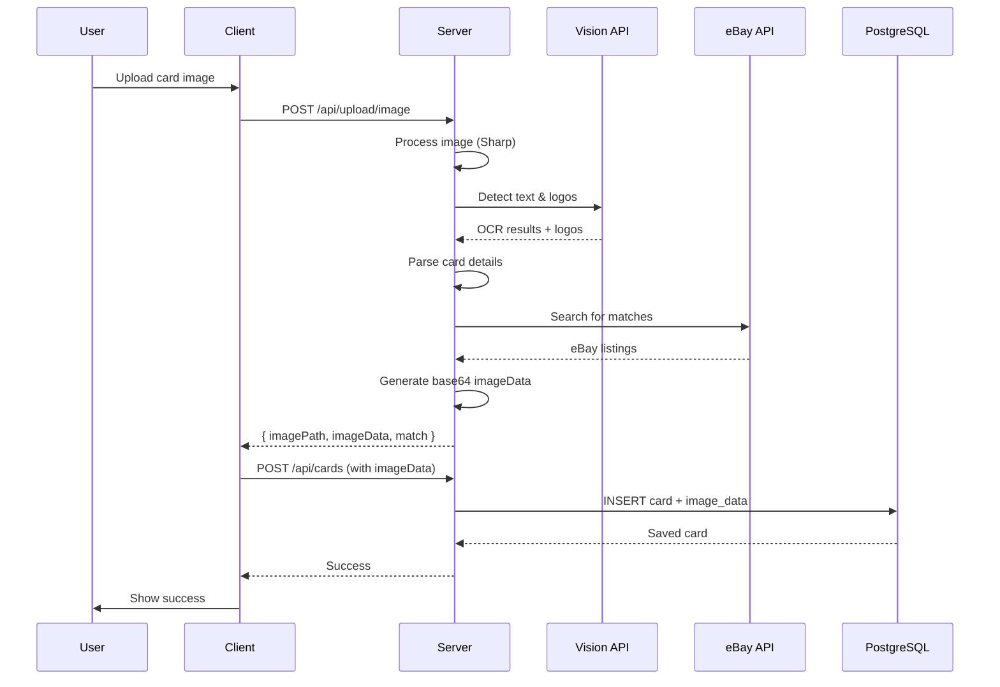

# CardShark - Sports Card Collection Tracker

A full-stack web application for managing sports card collections with AI-powered card matching and value tracking.

## Architecture Overview



## Data Flow - Card Upload



## Directory Structure

```
card-shark/
├── client/                 # React frontend
│   ├── src/
│   │   ├── components/     # Reusable UI components
│   │   ├── pages/          # Route pages (Gallery, Stats, Wishlist, Alerts)
│   │   ├── context/        # React contexts (Auth, Demo)
│   │   ├── services/       # API client
│   │   └── types/          # TypeScript types
│   └── index.html
│
├── server/                 # Express backend
│   ├── routes/             # API route handlers
│   │   ├── auth.js         # Google OAuth
│   │   ├── cards.js        # CRUD for cards
│   │   ├── upload.js       # Image upload + Vision
│   │   ├── stats.js        # Collection statistics
│   │   ├── alerts.js       # Price alerts
│   │   └── images.js       # DB-backed image serving
│   ├── services/           # Business logic
│   │   ├── vision.js       # Cloud Vision + parsing
│   │   └── ebay.js         # eBay search
│   ├── middleware/         # Express middleware
│   └── db/                 # Database setup + migrations
│
└── .ai/                    # AI agent documentation
```

## Key Features

| Feature | Description | Status |
|---------|-------------|--------|
| Card Upload | AI-powered OCR + logo detection | ✅ |
| eBay Matching | Auto-find similar cards for pricing | ✅ |
| Collection Stats | Value tracking, sport breakdown | ✅ |
| Price Alerts | Get notified when cards hit target | ✅ |
| Demo Mode | Try without login (sample data) | ✅ |
| Image Persistence | Base64 in DB (Railway-safe) | ✅ |
| Infinite Scroll | Paginated gallery | ✅ |
| Card Editing | Update card details inline | ✅ |
| Favorites | Heart/like cards for quick access | ✅ |
| Active Nav Tabs | Visual indicator for current page | ✅ |

## API Routes

### Cards
- `GET /api/cards` - List cards (supports filters, pagination)
- `POST /api/cards` - Create card (with imageData for persistence)
- `PUT /api/cards/:id` - Update card
- `DELETE /api/cards/:id` - Delete card

### Upload
- `POST /api/upload/image` - Upload + process card image

### Stats
- `GET /api/stats` - Full collection statistics
- `GET /api/stats/overview` - Overview alias

### Images
- `GET /api/images/:filename` - Serve image from database

### Alerts
- `GET /api/alerts` - List price alerts
- `POST /api/alerts` - Create alert
- `DELETE /api/alerts/:id` - Delete alert

## Environment Variables

| Variable | Description |
|----------|-------------|
| `DATABASE_URL` | PostgreSQL connection string |
| `GOOGLE_VISION_CREDENTIALS` | Cloud Vision API key (JSON) |
| `EBAY_CLIENT_ID` | eBay API app ID |
| `EBAY_CLIENT_SECRET` | eBay API secret |
| `TINIFY_API_KEY` | TinyPNG compression API |
| `GOOGLE_CLIENT_ID` | OAuth client ID |
| `GOOGLE_CLIENT_SECRET` | OAuth client secret |
| `JWT_SECRET` | Session signing key |
| `CLIENT_URL` | Frontend URL (CORS) |

## Team Matching Algorithm

The Vision service uses a **scoring-based matching system**:

1. Both OCR text and detected logos are checked against full team names
2. Each match is scored by completeness (longer match = higher score)
3. The source with the highest score wins

Example:
- OCR: "red wings" → score 9
- Logo: "Detroit Red Wings" → score 17
- **Logo wins** → Team set to "Detroit Red Wings"

## Image Persistence (Railway)

Railway's filesystem is ephemeral. Images are stored as base64 in the `image_data` column:

1. Upload saves to filesystem + generates base64
2. Card creation stores base64 in database
3. `/uploads/:filename` tries filesystem first, falls back to `/api/images/:filename`
4. `/api/images/:filename` serves from database

## Database Schema

```sql
CREATE TABLE users (
    id SERIAL PRIMARY KEY,
    google_id VARCHAR(255) UNIQUE,
    email VARCHAR(255),
    name VARCHAR(255),
    created_at TIMESTAMP DEFAULT NOW()
);

CREATE TABLE cards (
    id SERIAL PRIMARY KEY,
    user_id INTEGER REFERENCES users(id),
    image_path VARCHAR(255),
    image_data TEXT,              -- Base64 for persistence
    player_name VARCHAR(255),
    team VARCHAR(255),
    sport VARCHAR(50),
    year INTEGER,
    card_number VARCHAR(50),
    card_set VARCHAR(255),
    grade DECIMAL(3,1),
    value DECIMAL(10,2),
    purchase_price DECIMAL(10,2),
    is_wishlist BOOLEAN DEFAULT false,
    is_favorite BOOLEAN DEFAULT false,
    ebay_item_id VARCHAR(50),
    created_at TIMESTAMP DEFAULT NOW()
);

CREATE TABLE price_alerts (
    id SERIAL PRIMARY KEY,
    user_id INTEGER REFERENCES users(id),
    card_id INTEGER REFERENCES cards(id),
    target_price DECIMAL(10,2),
    is_active BOOLEAN DEFAULT true,
    created_at TIMESTAMP DEFAULT NOW()
);
```

## Development

```bash
# Server
cd server && npm install && npm run dev

# Client  
cd client && npm install && npm run dev
```

## Deployment (Railway)

1. Push to GitHub
2. Railway auto-deploys from main branch
3. Run migrations: `railway run psql -f server/db/migrations/XXX.sql`
